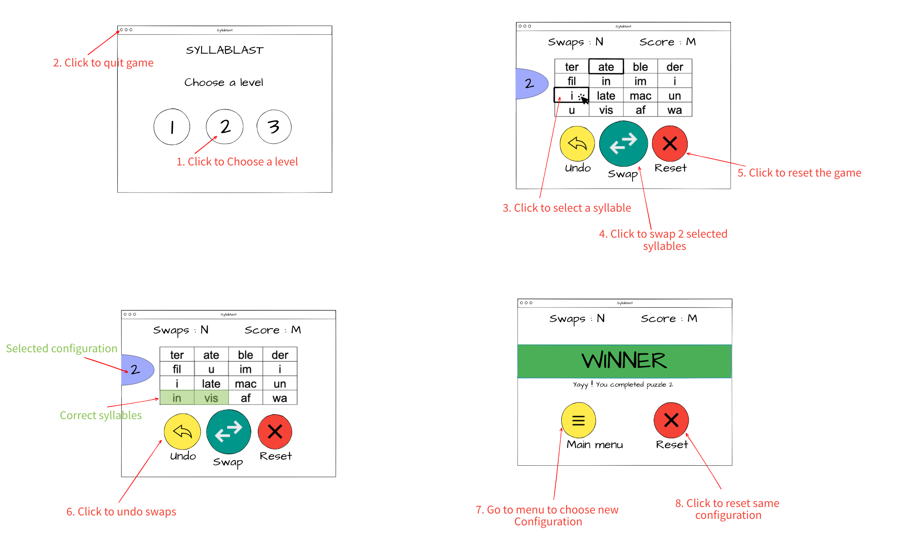
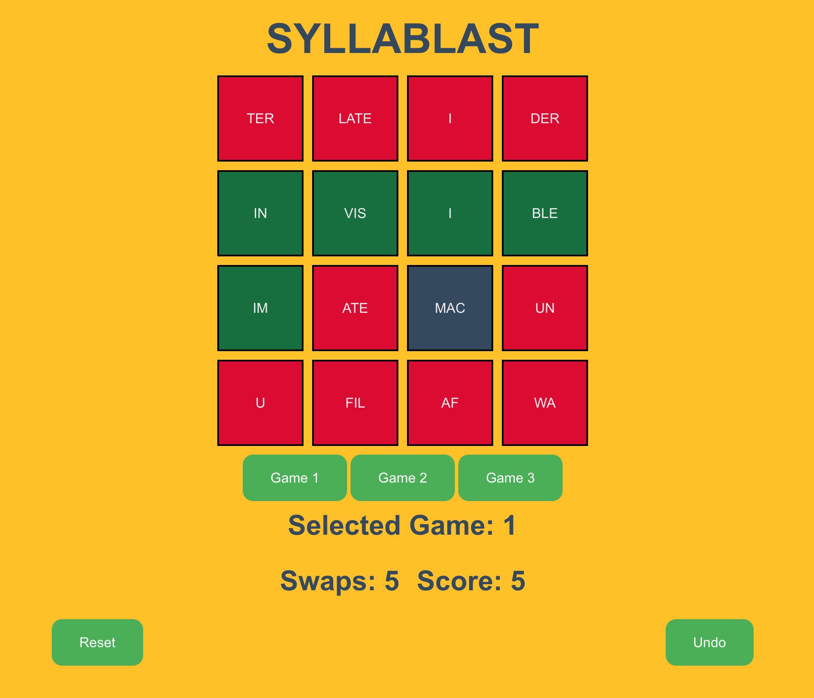

# 🎮 Syllablast

**Syllablast** is a fun, educational puzzle game built with [Next.js](https://nextjs.org), where players swap syllables to form correct words in the fewest number of moves. The game is designed to improve vocabulary, pattern recognition, and problem-solving skills.

---

## 🧠 Game Overview

The game presents players with a shuffled grid of syllables. Your task is to correctly reorder the syllables to form valid words. Each level increases in complexity, challenging you to think critically and plan your moves.

### 🎯 Objective

Rearrange the shuffled syllables by selecting and swapping them until all words are complete. Try to finish the puzzle in as few swaps as possible!

---

## 🕹️ How to Play

1. **Choose a Level**: Select a difficulty level (1, 2, or 3).
2. **Swap Syllables**: Click on two syllables to select and swap them.
3. **Undo**: Click "Undo" to reverse your last move.
4. **Reset**: Restart the current configuration or choose a new one.
5. **Win**: When all syllables form correct words, you win!

---

## 🛠️ Getting Started

### 1. Clone the Repository

```bash
git clone https://github.com/your-username/syllablast.git
cd syllablast


## Getting Started

First, install all dependancies.
```bash
npm install
```

then run the development server:

```bash
npm run dev
# or
yarn dev
# or
pnpm dev
# or
bun dev
```

## 🧱 Architecture

Syllablast follows the **Model-View-Controller (MVC)** pattern:

### Entity (Model)

- Handles game logic and data:
  - `Game`: Core logic, game completion, syllable evaluation.
  - `Model`: Holds game state, score, history.
  - `Syllable`, `Position`, `Swap`: Represent data structures and interactions.

### Boundary (View)

- UI logic lives in `SyllablastApp`, which renders:
  - Grid of syllables
  - Buttons (Swap, Undo, Reset)
  - Labels (Score, Swaps, Congratulations)

### Controller

- Manages user interactions and links UI to model:
  - `SelectController`
  - `SwapController`
  - `ResetController`
  - `UndoSwapController`

---

## 🖼️ Storyboard before development

Visual walkthrough of the user experience:



## 🖼️ Actual UI



### Key Actions:

- Select a level
- Click syllables to swap
- Undo or reset moves
- View WIN screen once solved
- Replay or return to main menu

---

## 🧩 Features

- Three difficulty levels
- Real-time score and swap tracking
- Undo and reset support
- Win condition detection
- Clean MVC architecture

---

## 📜 License

This project is open-source and available under the [MIT License](LICENSE).

---

## 🙌 Contributions

Contributions are welcome! Feel free to fork this repo and submit a pull request with improvements.


